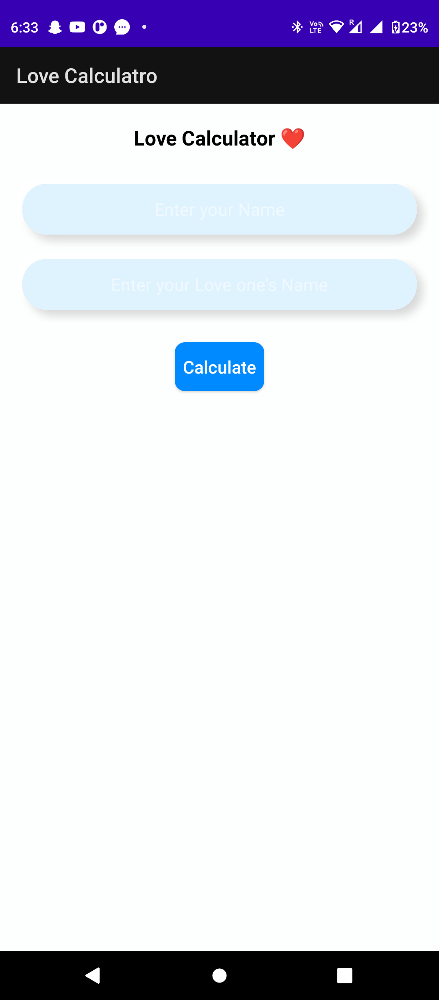
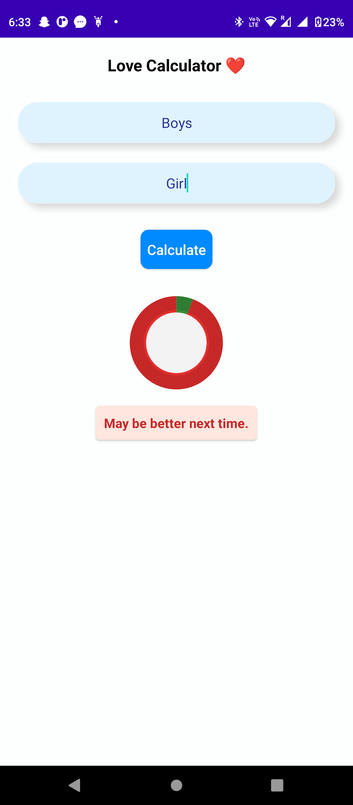

# Love 💖 Calculator Android App

 </a> <a href="https://www.java.com" target="_blank">  </a> <a href="https://www.java.com" target="_blank">  
  
 
 ## 🤔 What is this App
 
 ✍️ This is a basically a Love Calculator that will calculate love 🥰percentage 😉and comment appropriate comment 📝 for future  between lover and represent love percentage in a proper pie chart view to visualize more effectively in front of you.
 
 ## 💡 Features Used

1. Used Api for retrieve this random number and comments .
2. Here I used RapidApi 
4. Pie Chart


``` RapidAPI : https://rapidapi.com/ajith/api/love-calculator ```


<h1 align=center> Project Admin  🤵 </h1>

  <p align="center">
  <a href="https://github.com/maityamit"></a>

  <p align="center">
  <a target="_blank"href="https://www.linkedin.com/in/maityamit/"></a>&nbsp;&nbsp;&nbsp;&nbsp;
  <a href="maityamit308@gmail.com"></a>&nbsp;&nbsp;&nbsp;&nbsp;
  <a href="https://www.instagram.com/amit_maity_2003/"></a>&nbsp;&nbsp;&nbsp;&nbsp;
</p>
  
  <br>
  
  ## 📸 Screenshots
 

 

|||
|:----------------------------------------:|:-----------------------------------------:|
|  |  |
  
  
  
  <h2 align="center">📝 Created by </h2>


<h3>Amit maity</h3>

  <a href="https://linkedin.com/in/maityamit" target="blank"></a>
 <a href="https://instagram.com/amit_maity_2003" target="blank"></a>
  <a href="https://twitter.com/AmitMai40525308" target="blank"></a>
  <a href="https://github.com/maityamit" target="blank"></a>
  <a href="https://leetcode.com/maityamit/" target="blank"></a>
   <a href="https://www.hackerrank.com/maity_amit_coll1" target="blank"></a>
